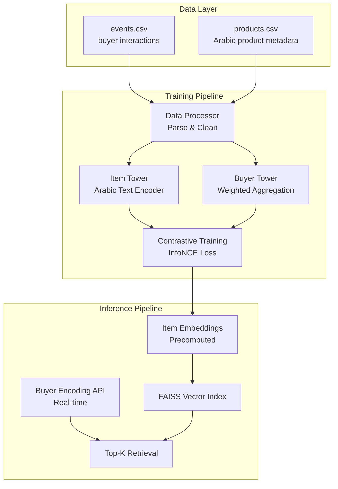

# Two-Tower Recommendation Retrieval System

## Architecture Overview




## Implementation Plan

### 1. Project Structure

```javascript
Two Tower model v2/
├── src/
│   ├── data/
│   │   ├── __init__.py
│   │   ├── processor.py          # Data loading and preprocessing
│   │   └── dataset.py            # PyTorch dataset for training
│   ├── models/
│   │   ├── __init__.py
│   │   ├── item_tower.py         # Item Tower (content-based)
│   │   ├── buyer_tower.py        # Buyer Tower (behavior-based)
│   │   └── two_tower.py          # Combined model
│   ├── training/
│   │   ├── __init__.py
│   │   ├── trainer.py            # Training loop
│   │   └── losses.py             # Contrastive loss functions
│   ├── inference/
│   │   ├── __init__.py
│   │   ├── encoder.py            # Embedding generation
│   │   └── vector_db.py          # FAISS index management
│   ├── api/
│   │   ├── __init__.py
│   │   └── server.py             # FastAPI endpoint
│   └── utils/
│       ├── __init__.py
│       └── config.py             # Configuration management
├── configs/
│   └── config.yaml               # Hyperparameters and settings
├── scripts/
│   ├── train.py                  # Training script
│   ├── generate_embeddings.py    # Batch embedding generation
│   └── build_index.py            # FAISS index creation
├── tests/
│   ├── test_item_tower.py
│   ├── test_buyer_tower.py
│   └── test_sanity_checks.py
├── requirements.txt
└── README.md
```


### 2. Data Processing ([src/data/processor.py](src/data/processor.py))

- **Event Processing**:
- Parse `events.csv` with columns: `distinct_id` (buyer_id), `product_id`, `event_name`, `created_at`
- Map event names: `View`→1, `AddToCart`→5, `Purchase`→10
- Sort by timestamp, create interaction sequences per buyer
- Handle missing/invalid data
- **Product Processing**:
- Parse `products.csv` with Arabic `title` and `description`
- Extract `brand` and `category` from JSON `metadata` field
- Combine `title + description` for text input
- Create product ID to metadata mapping
- **Dataset Creation**:
- Positive pairs: (buyer_id, product_id) from interactions
- Negative sampling: in-batch negatives + random product negatives
- Batch generation for training

### 3. Item Tower ([src/models/item_tower.py](src/models/item_tower.py))

- **Text Encoder**:
- Use `sentence-transformers` with multilingual model: `paraphrase-multilingual-MiniLM-L12-v2`
- Input: concatenated `title + " " + description` (Arabic text)
- Output: 384-dimensional embedding (model default)
- **Optional Categorical Features**:
- Embedding layers for `brand` and `category` (if provided)
- Concatenate with text embedding
- Projection layer to final embedding dimension
- **Normalization**:
- L2-normalize final item embeddings
- Output dimension: 384 (or configurable)

### 4. Buyer Tower ([src/models/buyer_tower.py](src/models/buyer_tower.py))

- **Input Processing**:
- Receive sequence of `(product_id, event_weight)` tuples
- Map product IDs to item embeddings (from Item Tower)
- **Aggregation Methods** (configurable):
- **Weighted Average**: Simple weighted sum with L2 normalization
- **Attention Mechanism**: Learnable attention weights over interaction sequence
    - Query: learnable buyer context vector
    - Keys/Values: weighted item embeddings
    - Output: attended aggregation
- **Normalization**:
- L2-normalize final buyer embedding
- Same dimension as item embeddings

### 5. Training Pipeline ([src/training/trainer.py](src/training/trainer.py))

- **Loss Function**:
- InfoNCE (contrastive loss) with temperature scaling
- Positive: cosine similarity between buyer and interacted product
- Negatives: in-batch negatives + sampled random negatives
- **Training Loop**:
- Freeze Item Tower text encoder (pretrained), fine-tune projection layers
- Train Buyer Tower from scratch
- Batch size, learning rate, epochs configurable
- Validation split for monitoring
- **Checkpointing**:
- Save model checkpoints
- Track best model based on validation metrics

### 6. Embedding Generation ([src/inference/encoder.py](src/inference/encoder.py))

- **Item Embeddings (Offline)**:
- Load trained Item Tower
- Process all products in batch
- Generate and save embeddings for all products
- Output: `product_embeddings.npy` + `product_ids.npy`
- **Buyer Embeddings (Online)**:
- Load trained Buyer Tower
- Accept recent interactions (last N events)
- Generate buyer embedding in real-time
- Stateless inference

### 7. Vector Database ([src/inference/vector_db.py](src/inference/vector_db.py))

- **FAISS Index**:
- Build FAISS IndexFlatIP (inner product for cosine similarity)
- Add all product embeddings (L2-normalized)
- Save index to disk: `product_index.faiss`
- Load index for retrieval
- **Retrieval**:
- Given buyer embedding, retrieve Top-K products
- Return product IDs and similarity scores
- Efficient batch retrieval support

### 8. API Endpoint ([src/api/server.py](src/api/server.py))

- **FastAPI Server**:
- `POST /encode_buyer`:
    - Input: `{"buyer_id": str, "recent_interactions": [{"product_id": str, "event_type": str, "timestamp": str}]}`
    - Output: `{"buyer_embedding": [float], "dimension": int}`
- `GET /retrieve`:
    - Input: `{"buyer_id": str, "k": int}`
    - Output: `{"product_ids": [str], "scores": [float]}`
- Health check endpoint
- **Performance**:
- Model loading at startup
- Fast inference (<100ms target)
- Async support

### 9. Sanity Checks ([tests/test_sanity_checks.py](tests/test_sanity_checks.py))

- **Item Embedding Validation**:
- Test: `similarity("خاتم ذهب", "سلسال ذهب")` → HIGH (>0.7)
- Test: `similarity("خاتم ذهب", "زيت محرك")` → LOW (<0.3)
- **Buyer Behavior Validation**:
- Simulate buyer with repeated gold ring interactions
- Verify Top-K retrieval contains jewelry items
- Verify no unrelated categories (cars, food) in top results

### 10. Configuration ([configs/config.yaml](configs/config.yaml))

- Model hyperparameters (embedding dim, hidden dims)
- Training settings (batch size, learning rate, epochs)
- Event weights (view, add_to_cart, purchase)
- Aggregation method (weighted_avg vs attention)
- Paths for data, checkpoints, embeddings

## Key Design Decisions

1. **Multilingual Sentence-Transformers**: Balance between Arabic support and ease of deployment
2. **Dual Aggregation Methods**: Configurable weighted average (fast) and attention (expressive)
3. **Separate Training/Inference**: Clear separation for production deployment
4. **FAISS for Retrieval**: Industry-standard, efficient vector search
5. **Stateless API**: Real-time buyer encoding without retraining